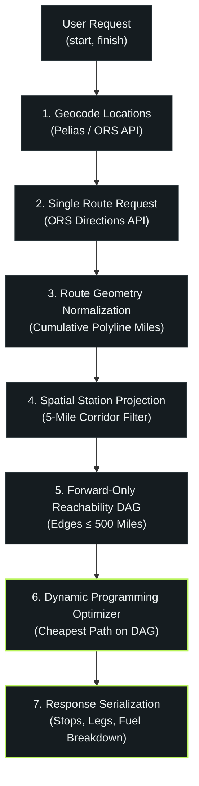
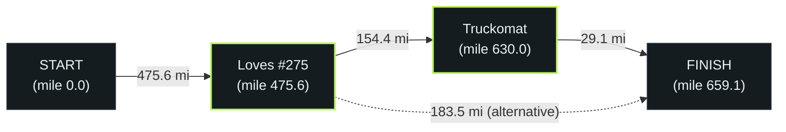
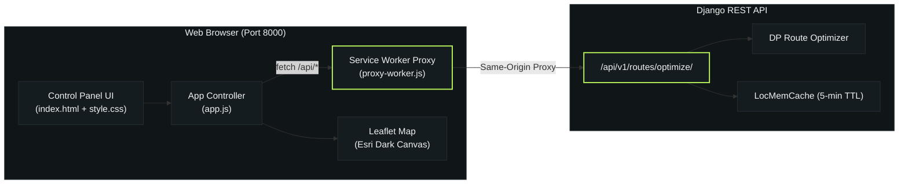

# Fuel-Check: Optimal Fuel Stop Planner API

A Django REST Framework service that calculates optimal fuel stops and minimum fuel expenses for long-distance routes across the United States.

---

## 1. Problem & Specifications

Given a **start** and **finish** location in the United States, the system computes:
- The optimal driving route, distance, and duration.
- Recommended fuel stops along the route where fuel should be purchased to minimize total expense.
- Total cost of fuel purchased and fuel consumed.

### Vehicle & Fuel Constraints
- **Maximum Range:** 500 miles per full tank.
- **Fuel Efficiency:** 10 miles per gallon (MPG).
- **Starting Fuel Tank:** Depart with a full 500-mile tank (50 gallons).
- **Refueling Policy:** Fuel needed for each subsequent leg is purchased at the station where that leg begins.

---

## 2. Architecture & Pipeline



### Single Routing Call Efficiency
Unlike naive implementations that make separate routing calls for every potential station, **Fuel-Check makes exactly one Directions API call per optimization request**. Station reachability, route positioning, and leg distances are computed geometrically along the returned route polyline.

---

## 3. Algorithm & Theoretical Foundations

### A. Station Projection onto Route Polyline
For each geocoded station $S$, the distance to each route segment `[P_i, P_{i+1}]` is determined using local flat-plane projection:
1. Coordinates are projected into a local Euclidean coordinate system (in miles) centered at the segment's latitude.
2. The orthogonal projection fraction $t \in [0, 1]$ onto segment `[A, B]` is computed:

```math
t = \max\left(0, \min\left(1, \frac{(P - A) \cdot (B - A)}{\|B - A\|^2}\right)\right)
```

3. The closest segment defines the station's `distance_to_route` and interpolated `route_mile`.
4. Stations exceeding `tolerance_miles = 5.0` are discarded.
5. Remaining candidate stations are sorted by `route_mile` and deduplicated by coordinates.

### B. Forward-Only Reachability DAG
The candidate stations, bounded by `START` (mile 0.0) and `FINISH` (total route miles), form an ordered sequence of nodes:

```math
N_0 (\text{START}) < N_1 < N_2 < \dots < N_k (\text{FINISH})
```

A directed edge $(u, v)$ is added if and only if:
1. $u$ precedes $v$ along the route: $\text{mile}(u) < \text{mile}(v)$ (guaranteeing a Directed Acyclic Graph).
2. The distance satisfies vehicle reachability:

```math
\text{distance}(u, v) = \text{mile}(v) - \text{mile}(u) \le 500\text{ miles}
```



### C. Dynamic Programming Optimizer
Because the graph is a topological DAG ordered by `route_mile`, the minimum-cost path from `START` to `FINISH` is solved via Dynamic Programming in linear time:

- $\text{cost}[\text{START}] = 0.0$
- For each node $u$ in topological order:
  - For each outgoing edge $(u, v)$ with distance $d$:
    - Fuel required: $g = d / \text{MPG}$
    - Leg fuel cost:

```math
\text{fuel cost} = 
\begin{cases} 
0.0 & \text{if } u = \text{START (vehicle starts full)} \\ 
g \times \text{retail price}(u) & \text{if } u \text{ is a station} 
\end{cases}
```

    - If $\text{cost}[u] + \text{fuel cost} < \text{cost}[v]$:

```math
\text{cost}[v] = \text{cost}[u] + \text{fuel cost}, \quad \text{predecessor}[v] = u
```

If $\text{cost}[\text{FINISH}] = \infty$, no sequence of stations exists where every gap is $\le 500$ miles; the API returns **HTTP 422 Unprocessable Entity**.

### D. Computational Complexity
| Stage | Complexity | Practical Performance |
| :--- | :--- | :--- |
| **Station Projection** | $O(S \times R)$ | $\approx 588 \text{ stations} \times 3{,}000 \text{ points} \approx 0.15\text{s}$ |
| **Graph Construction** | $O(V^2)$ worst case | $V \le 20 \text{ candidates} \implies < 1\text{ms}$ |
| **DAG Optimization** | $O(V + E)$ | $V \le 20 \implies < 1\text{ms}$ |

---

## 4. Fuel Accounting Model

The response explicitly separates fuel *consumed* across the journey from fuel *purchased* at stations:

```json
"fuel": {
  "mpg": 10,
  "max_range_miles": 500,
  "consumed_gallons": 65.91,
  "starting_fuel_gallons": 50,
  "modeled_purchased_gallons": 18.34,
  "total_cost": 60.63
}
```

- **`starting_fuel_gallons` (50 gal):** Initial full tank available at trip start.
- **`consumed_gallons`:** Total fuel consumed to travel the entire distance (`distance_miles / 10`).
- **`modeled_purchased_gallons`:** The incremental gallons bought at intermediate stops to complete subsequent legs.
- **`total_cost`:** Total expenditure incurred at the chosen stations.

---

## 5. Data Cleaning & Station Geocoding

- **Source Dataset:** 8,151 commercial fuel price records from the Oil Price Information Service (OPIS) across the US and Canada.
- **Preprocessing:** Resolved Windows-1252 character encoding, stripped unescaped quotes in highway descriptions (e.g. `I-80, EXIT 15 "A"`), and filtered out non-US Canadian entries.
- **Batch Geocoding:** Used the US Census Bureau Batch Geocoder in chunks of 500 records with exponential retry backoff to avoid API fees and rate limits.
- **Matched Stations (588 coordinates, 7.2%):** Stations with standard postal street numbers or identifiable road intersections resolved to precise coordinates.
- **Unmatched Stations (7,563 rows, 92.8%):** Commercial truck stops frequently record addresses using highway exit descriptions (e.g., `I-40 EXIT 156 & US-69`) without street house numbers, which the Census address engine cannot parse.

> [!NOTE]
> For the complete data engineering narrative, technical challenges, and standalone geocoding script, see **[DATA_PREPARATION.md](DATA_PREPARATION.md)**.

### Regional Coverage & Route Feasibility
- Geocoded stations are concentrated in the Midwest and South (`TX: 72`, `IL: 70`, `WI: 38`, `FL: 36`, `AL: 26`, `IN: 22`, `AR: 21`, `MO: 19`, `GA: 21`).
- **Feasible Corridors:** Routes passing through these states (e.g. Chicago → Little Rock, St. Louis → Houston) have dense station coverage and generate multi-stop optimal plans.
- **Sparse Corridors (HTTP 422):** Routes traversing states with sparse geocoded stations (e.g. PA/OH along I-80 for New York → Chicago) have gaps exceeding 500 miles. The API correctly returns **HTTP 422 Unprocessable Entity**, upholding the 500-mile max range constraint.

---

## 6. Ready-to-Test Routes (Copy & Paste Examples)

Evaluators can test the API immediately using these verified routes:

### Example 1: Multi-Stop Route (2 Fuel Stops)
```bash
curl -X POST http://127.0.0.1:8000/api/v1/routes/optimize/ \
  -H "Content-Type: application/json" \
  -d '{"start": "Chicago, IL", "finish": "Little Rock, AR"}'
```
- **Distance:** 659.1 miles
- **Total Cost:** $60.63
- **Stops Chosen:**
  1. `LOVES TRAVEL STOP #275` (Palestine, AR @ mile 475.6)
  2. `TRUCKOMAT OF N LITTLE ROCK` (North Little Rock, AR @ mile 630.0)

### Example 2: Long-Distance Corridor (2 Fuel Stops)
```bash
curl -X POST http://127.0.0.1:8000/api/v1/routes/optimize/ \
  -H "Content-Type: application/json" \
  -d '{"start": "St. Louis, MO", "finish": "Houston, TX"}'
```
- **Distance:** 776.3 miles
- **Total Cost:** $95.84
- **Stops Chosen:**
  1. `RACETRAC #2641` (Texarkana, TX @ mile 424.0)
  2. `EZ TRAVEL CENTER` (Willis, TX @ mile 728.8)

### Example 3: Mid-South Corridor (1 Fuel Stop)
```bash
curl -X POST http://127.0.0.1:8000/api/v1/routes/optimize/ \
  -H "Content-Type: application/json" \
  -d '{"start": "Milwaukee, WI", "finish": "Atlanta, GA"}'
```
- **Distance:** 813.9 miles
- **Total Cost:** $104.46
- **Stop Chosen:** `Circle K #4703911` (Portland, TN @ mile 474.3)

### Example 4: Direct Trip Under 500 Miles (0 Fuel Stops)
```bash
curl -X POST http://127.0.0.1:8000/api/v1/routes/optimize/ \
  -H "Content-Type: application/json" \
  -d '{"start": "Dallas, TX", "finish": "Houston, TX"}'
```
- **Distance:** 235.3 miles
- **Total Cost:** $0.00 (vehicle completes trip on initial 50-gallon full tank; 0 intermediate stops needed)

### Example 5: Infeasible Route (HTTP 422)
```bash
curl -X POST http://127.0.0.1:8000/api/v1/routes/optimize/ \
  -H "Content-Type: application/json" \
  -d '{"start": "New York, NY", "finish": "Chicago, IL"}'
```
- **Status:** `422 Unprocessable Entity`
- **Response:**
  ```json
  {
    "error": "No feasible fuel-stop plan exists for this route.",
    "route": {
      "distance_miles": 800.43,
      "duration_minutes": 839.11
    }
  }
  ```

---

## 7. API Reference

### `POST /api/v1/routes/optimize/`

Calculates the optimal fuel stops for a route between two US locations.

#### Request Body
```json
{
  "start": "Chicago, IL",
  "finish": "Little Rock, AR"
}
```

#### Response (200 OK)
```json
{
  "start": {
    "longitude": -87.66063,
    "latitude": 41.87897,
    "label": "Chicago, IL, USA"
  },
  "finish": {
    "longitude": -92.355844,
    "latitude": 34.713561,
    "label": "Little Rock, AR, USA"
  },
  "route": {
    "distance_miles": 659.07,
    "duration_minutes": 649.42,
    "geometry": {
      "type": "LineString",
      "coordinates": [
        [-87.66063, 41.87897],
        [-87.6607, 41.8785],
        "..."
      ]
    }
  },
  "fuel": {
    "mpg": 10,
    "max_range_miles": 500,
    "consumed_gallons": 65.91,
    "starting_fuel_gallons": 50,
    "modeled_purchased_gallons": 18.34,
    "total_cost": 60.63
  },
  "fuel_stops": [
    {
      "id": 1750,
      "name": "LOVES TRAVEL STOP #275",
      "city": "Palestine",
      "state": "AR",
      "latitude": 34.9691,
      "longitude": -90.9022,
      "price_per_gallon": 3.31567,
      "route_mile": 475.63,
      "gallons": 15.44,
      "cost": 51.19
    },
    {
      "id": 505,
      "name": "TRUCKOMAT OF N LITTLE ROCK",
      "city": "North Little Rock",
      "state": "AR",
      "latitude": 34.7891,
      "longitude": -92.2285,
      "price_per_gallon": 3.249,
      "route_mile": 630.0,
      "gallons": 2.91,
      "cost": 9.44
    }
  ],
  "legs": [
    {
      "from": "START",
      "to": "STATION_1750",
      "distance_miles": 475.63,
      "gallons": 0.0,
      "fuel_cost": 0.0
    },
    {
      "from": "STATION_1750",
      "to": "STATION_505",
      "distance_miles": 154.38,
      "gallons": 15.44,
      "fuel_cost": 51.19
    },
    {
      "from": "STATION_505",
      "to": "FINISH",
      "distance_miles": 29.06,
      "gallons": 2.91,
      "fuel_cost": 9.44
    }
  ]
}
```

#### Error Responses
- **400 Bad Request:** Missing/blank parameters or location not found by geocoder.
  ```json
  {"error": "Location not found: UnknownPlaceXYZ"}
  ```
- **422 Unprocessable Entity:** No reachable station sequence satisfies the 500-mile vehicle range.
  ```json
  {
    "error": "No feasible fuel-stop plan exists for this route.",
    "route": {
      "distance_miles": 800.43,
      "duration_minutes": 839.11
    }
  }
  ```
- **502 Bad Gateway:** External routing/geocoding service unavailable.

#### Response Caching (Small TTL)
To conserve external geocoding and routing API quotas, optimize latency, and prevent redundant calculations:
- Identical `(start, finish)` requests are normalized and cached in memory using a SHA-256 key.
- **TTL:** 300 seconds (5 minutes) configurable via `ROUTE_CACHE_TTL` in environment.
- Responses contain an **`X-Cache`** header:
  - `X-Cache: MISS` — First request; route computed and cached.
  - `X-Cache: HIT` — Subsequent request within TTL; served immediately from memory.
- In addition, the frontend maintains a client-side in-memory cache for immediate 0ms UI updates.

---

## 8. Testing & Verification

The test suite covers:
- **Haversine Distance & Route Normalization:** Distance accuracy and cumulative route-mile indexing.
- **Station Projection:** Station matching within 5-mile tolerance and rejection beyond tolerance.
- **Forward-Only DAG & 500-Mile Range:** Verified reachable (500 mi) and unreachable (501 mi) edge creation; acyclic forward direction.
- **Synthetic Cost Optimization:** Proves cheaper station is selected over expensive alternatives when both are reachable.
- **Infeasible Path Detection:** Correctly identifies unreachable gaps and returns `None`.
- **API Serializer & Error Handling:** Validates 400 Bad Request, 422 Unprocessable Entity, and 200 OK contracts.

### Run Tests
```bash
python manage.py test
```

Expected output:
```text
Found 16 test(s).
Creating test database for alias 'default'...
................
----------------------------------------------------------------------
Ran 16 tests in 0.026s

OK
```

---

## 9. Setup & Local Development

### Prerequisites
- Python 3.11+
- SQLite or PostgreSQL
- OpenRouteService API key

### Installation
```bash
# Clone repository
git clone https://github.com/your-username/Fuel-check.git
cd Fuel-check

# Install dependencies
pip install -r requirements.txt

# Configure environment variables
export ORS_API_KEY="your-openrouteservice-api-key"

# Apply database migrations
python manage.py migrate

# (Optional) Import fuel stations CSV
python manage.py import_fuel_prices fuel_prices_with_coordinates.csv

# Run test suite
python manage.py test

# Start development server
python manage.py runserver
```

---

## 10. Frontend Control Panel

A lightweight, zero-framework vanilla web client (`HTML`, `CSS`, `Vanilla JS`, `Leaflet`) providing a dark geospatial control panel to interact with the route optimization API.

### File Structure
```text
frontend/
├── index.html        # Control panel markup & Leaflet CDN integration
├── style.css         # Dark geospatial theme & responsive grid
├── app.js            # Leaflet map, route polyline rendering, API calls
└── proxy-worker.js   # Service Worker architectural proxy for GitHub Codespaces
```

### Architecture



### Features
- **Interactive Leaflet Map:** Displays the normalized route polyline (accent neon green) on Esri World Dark Gray Canvas basemap (no API key required).
- **Station & Endpoint Markers:** Start and destination flags, plus interactive circle markers for each chosen fuel stop displaying station details, location, and price.
- **Summary Metrics Dashboard:** Real-time distance, drive time, fuel consumed, and modeled fuel expenditure.
- **Sequential Fuel Stop List:** Numbered itinerary showing station name, city/state, price/gal, and mile marker along the route.
- **Service Worker Proxy:** Pure frontend network proxy (`proxy-worker.js`) that intercepts `/api/*` fetch calls and proxies them seamlessly on the same domain.
- **Client-Side In-Memory Cache:** Instant 0ms rendering for repeated searches within a 5-minute TTL.

### Running the Frontend
Since the frontend is served on the same domain as the backend, you only need to start the Django server:

```bash
python manage.py runserver
```

1. In GitHub Codespaces, go to the **Ports** tab or click **"Open in Browser"** on forwarded port **8000**.
2. The browser opens the control panel at `/`.
3. The Service Worker proxy automatically intercepts relative `/api/*` requests on the same domain (`self.location.origin`).